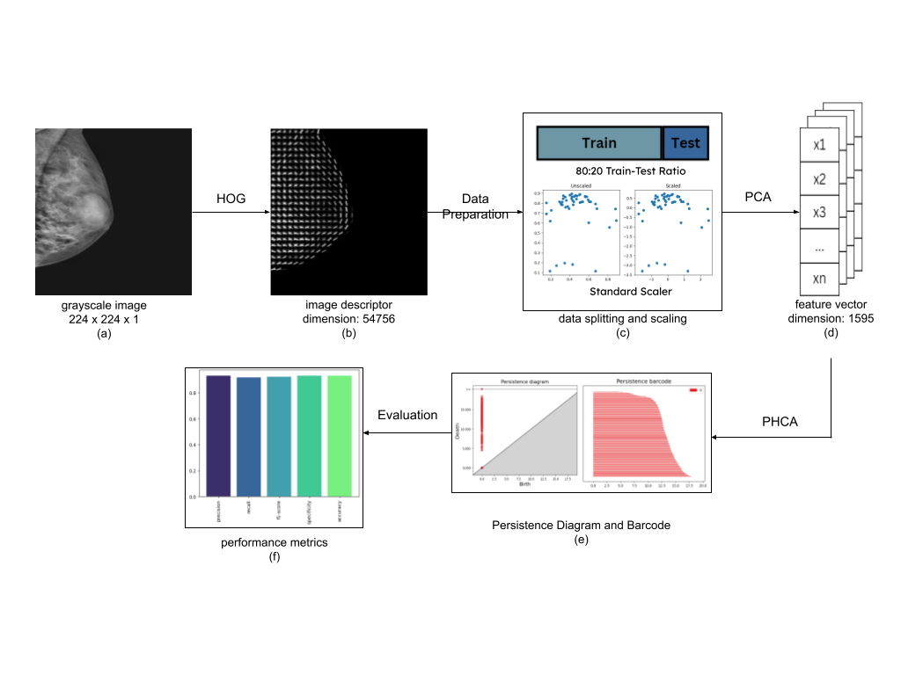
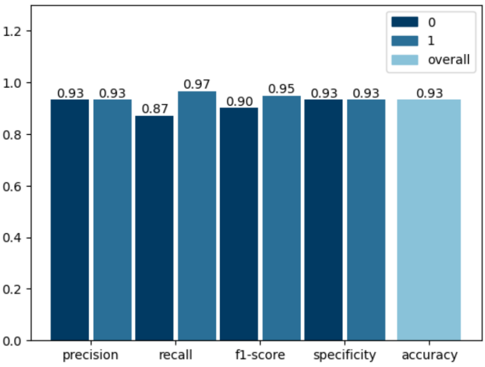

# BreastCancer-TDA: Breast Cancer Mammogram Scans Classification using PHCA and HOG

**Authors:** CB Jetomo, MD De Lara

## Rationale
This paper harnesses the computational flexibility of Persistent Homology in classification of mammogram scans. These scans are used in medicine wherein breast tissues are exposed to small amounts of X-ray radiation to obtain an inside picture of the breast details for the purpose of abnormality/mass detection and classification [1]. Particularly, it aims to differentiate benign breast tumors from their malignant counterparts using the breast mammogram. Classification between benign and malignant images is done using Persistent Homology Classification Algorithm (PHCA) [2].

## Framework

The framework of the implementation is presented in the figure above. All images are first converted into grayscale having dimension 224 pixels x 224 pixels x 1 channel. Then, HOG is implemented on each pixel. The defined parameters for the feature descriptor are (8,8) pixels per cell and (3,3) cells per block. The feature descriptor from HOG is then flattened to obtain some vector of dimension 54,756 for each image. Now, due to computational limitations of the device used, only 6000 images are considered from the dataset. Of which, 2017 images are classified as benign and 3983 are malignant. The images are then split into training and testing sets with ratio 80:20. In particular, 4800 images were used for training and 1200 images for validation or testing. After this, the image descriptors are scaled using Standard Scaler. Finally for the preprocessing stage, PCA is performed on the dataset to reduce the dimension. The final feature vectors used for classification are of dimension 1595 each. 
After preprocessing, classification is done using PHCA. Here, Persistent Homology is implemented for each class of the training data and the Persistence Diagram and Barcode are obtained. For each class, the total lifespan is computed from its obtained diagram or barcode. In this problem, only two persistence barcodes are generated since there are only two classes namely, benign and malignant. Now for the validation process, each test data is determined to which class it belongs. A summary of this process is given in Section III. The output of PHCA is a vector of binary values (0 or 1) representing the predicted class of each test data. 
The performance of PHCA is then quantified using five evaluation metrics: Precision, Recall, F1-score, Specificity, and overall Accuracy. The implementation is done using Python with the aid of Google Colab.

## Results
Performing classification on the dataset, we obtain the classification report given in the figure below. Here, we see that the obtained Precision values for Class 0 (benign) and Class 1 (malignant) are both 93%. This implies that of all images classified to be benign,  93% of which are correctly classified. The same setup also follows for the malignant class based on this result. In addition, we see from the figure that the obtained Recall values for the two classes are 87% and 97%, respectively. This means that 87% and 97% of benign and malignant validation images, respectively, are correctly classified. In other words, the model is better in predicting malignant images in terms of correct classification. Now as a summary, F1-scores obtained are 90% and 95% which states the difference of performance of the model in classifying to the two classes. In contrast to Recall, Specificity values tell us how well our model performed in classifying images not belonging to a class. The obtained values of 93% for both classes shows that the model is good in avoiding making misclassifications. Finally, the overall accuracy obtained is also 93% indicating how good the model is in terms of making correct classifications.

## Conclusion
This paper presents the potential of Persistent Homology (PH), a technique from Topological Data Analysis, in classifying mammogram scans. Particularly, it shows how PH can be used in distinguishing breast scans having the presence of cancer or otherwise. Numerous preprocessing steps have been implemented on the images to enhance the classification of the PHCA model. Initially, HOG is used to extract useful information from the images. The feature descriptors detected by HOG were then scaled to remove outliers. Then, PCA is performed on the scaled descriptors to reduce the dimension of the features. Classification on 6000 of these mammogram scans using the novel classifier PHCA shows excellent results. This is shown mainly by the obtained overall Accuracy of 93%. However, this metric lacks some properties that describe important findings from the result of the classification. One of which is that it doesn’t show indepthly the misclassification made by the model. With this, four other metrics are obtained which are Precision, Recall, F1-score, and Sensitivity. The high Precision and Recall values, having an average of 93% and 92%, respectively, measures how the model makes correct predictions. F1-score summarizes these two metrics which obtained an average value of 92.50%. Finally, the average Specificity value is 93% showing how well the model avoids misclassifications.

## References
[1]	A. Asaad, D. Ali, T. Majeed, and R. Rashid, ‘Persistent Homology for Breast Tumor Classification Using Mammogram Scans’, Mathematics, vol. 10, no. 21, 2022.
[2]	M. L. D. De Lara, ‘Persistent homology classification algorithm’, PeerJ Computer Science, vol. 9, p. e1195, 2023.

